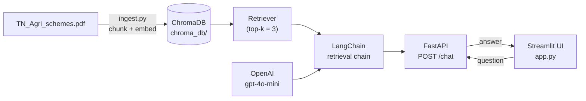

# 🌾 TN Farmers Agri Schemes — RAG Assistant

A Retrieval-Augmented Generation (RAG) chatbot that answers questions about **Tamil Nadu Agriculture Farmer Schemes**, grounded strictly in official TNAU scheme documentation. Built with **LangChain**, **ChromaDB**, **FastAPI**, **Streamlit**, and **OpenAI**.

Ask about seed subsidies, farm mechanisation, irrigation support, pump sets, crop insurance, and credit — and get answers sourced from the actual scheme text, not the model's general knowledge.

## Table of Contents

- [Overview](#overview)
- [Features](#features)
- [Architecture](#architecture)
- [Tech Stack](#tech-stack)
- [Project Structure](#project-structure)
- [Getting Started](#getting-started)
- [Building the Vector Store](#building-the-vector-store)
- [Running the App](#running-the-app)
- [API Reference](#api-reference)
- [Sample Questions](#sample-questions)
- [Troubleshooting](#troubleshooting)
- [Known Limitations & Roadmap](#known-limitations--roadmap)
- [Disclaimer](#disclaimer)
- [Author](#author)

## Overview

The source scheme document (`TN_Agri_schemes.pdf`) is chunked and embedded into a local **ChromaDB** vector store. At query time, a **LangChain** retrieval chain pulls the most relevant chunks and feeds them to **GPT-4o mini**, which answers *only* from that retrieved context — reducing hallucinated eligibility or subsidy figures. The FastAPI backend exposes this as a `/chat` endpoint; the Streamlit frontend provides a themed chat UI on top of it.

## Features

- 🎨 **Themed Streamlit UI** — Tamil Nadu green/gold color scheme, hero banner, and a card-based scheme explorer (Seed & Crop, Mechanisation, Water & Irrigation, Pump Sets, Insurance & Credit)
- 💬 **Chat interface** with persistent session history and farmer/assistant avatars
- ⚡ **One-click quick questions** — category-grouped prompts in the sidebar and "Ask about this →" buttons on each scheme card
- 🔌 **FastAPI REST backend** with CORS enabled for the Streamlit frontend
- 🧠 **LangChain RAG chain** — `create_retrieval_chain` + `create_stuff_documents_chain` over a Chroma retriever (top-3 chunks)
- 📚 **ChromaDB** local vector store, built once via `ingest.py`
- ❤️ **Health check endpoint** (`/health`) reporting whether the RAG chain has finished loading
- 🛡️ **Graceful error handling** in the UI for backend timeouts, connection failures, and request errors
- 📖 **Interactive API docs** via FastAPI's built-in Swagger UI (`/docs`)
- 🪟 **Windows-safe startup** — stdout/stderr are forced to UTF-8 so emoji log lines don't crash `uvicorn` under the default `cp1252` console codepage

## Architecture



## Tech Stack

| Layer | Technology |
|---|---|
| Frontend | Streamlit |
| Backend API | FastAPI + Uvicorn |
| Orchestration | LangChain (`langchain`, `langchain-community`, `langchain-openai`) |
| Vector store | ChromaDB |
| LLM | OpenAI `gpt-4o-mini` |
| Embeddings | OpenAI Embeddings |
| Config | python-dotenv |
| Language | Python 3.12 |

## Project Structure

```
tnagri-rag-app/
├── main.py               # FastAPI backend: loads Chroma + builds the RAG chain on startup
├── app.py                # Streamlit frontend: themed chat UI, calls the /chat endpoint
├── ingest.py              # One-off script to build chroma_db/ from the source document(s)
├── TN_Agri_schemes.pdf    # Source scheme document
├── chroma_db/             # Generated vector store (not committed — build it locally)
├── .env                   # OPENAI_API_KEY (not committed)
└── README.md
```

> **Note:** this repo does not currently ship a `requirements.txt` — see [Getting Started](#getting-started) for the explicit install command, or generate one yourself with `pip freeze > requirements.txt` once your venv is set up.

## Getting Started

1. **Clone the repository**
   ```bash
   git clone https://github.com/natrajexplore/TN_Farmers_Agri_Schemes.git
   cd TN_Farmers_Agri_Schemes
   ```

2. **Create and activate a virtual environment**
   ```bash
   python -m venv venv
   ```
   Windows:
   ```bash
   venv\Scripts\activate
   ```
   Linux/macOS:
   ```bash
   source venv/bin/activate
   ```

3. **Install dependencies**
   ```bash
   pip install streamlit requests fastapi uvicorn python-dotenv pydantic \
               langchain langchain-community langchain-openai langchain-chroma chromadb openai
   ```

4. **Configure environment variables** — create a `.env` file in the project root:
   ```
   OPENAI_API_KEY=your_openai_api_key
   ```

## Building the Vector Store

`ingest.py` loads the source content, splits it into 1000-character chunks (200-character overlap), embeds them, and persists the result to `./chroma_db`.

```bash
python ingest.py
```

Before running it, note it currently needs two manual edits for your environment:
- the `PyPDFLoader("path_to_downloaded_scheme.pdf")` path is a placeholder — point it at `TN_Agri_schemes.pdf` (or your own document)
- the HTML-scraping path uses `PlaywrightURLLoader`, which requires Playwright's browser binaries (`pip install playwright && playwright install`) — if you only need the PDF, you can skip that loader entirely

The script also expects `OPENAI_API_KEY` to already be set (it currently sets it inline — prefer relying on your `.env` / environment instead).

## Running the App

**1. Start the FastAPI backend:**
```bash
python -m uvicorn main:app --reload
```
- API: http://127.0.0.1:8000
- Swagger UI: http://127.0.0.1:8000/docs
- Health check: http://127.0.0.1:8000/health

**2. Start the Streamlit frontend** (in a second terminal, with the venv activated):
```bash
streamlit run app.py
```
- App: http://localhost:8501

The backend must be running before the frontend can answer questions — the UI will show a connection error otherwise.

## API Reference

### `GET /`
Returns basic service info and the available endpoints.

### `GET /health`
```json
{ "status": "ready", "chain_loaded": true }
```

### `POST /chat`
Request:
```json
{ "question": "What is the subsidy for tractor purchase?" }
```
Response:
```json
{ "answer": "..." }
```
On failure:
```json
{ "error": "..." }
```

## Sample Questions

- What is the premium for certified Paddy seed production, and how does the Seed Village Scheme work?
- What is the subsidy for purchasing a Tractor, Power Tiller, or Paddy Transplanter?
- What are the benefits offered for Rain Water Harvesting, Farm Ponds, and check dams?
- What is the subsidy for replacing an old agricultural electrical pump set?
- How does the National Agricultural Insurance Scheme and the Kisan Credit Card Scheme help farmers?

## Troubleshooting

| Symptom | Likely Cause | Fix |
|---|---|---|
| Streamlit shows "Could not reach the backend" | FastAPI server isn't running | Start it with `python -m uvicorn main:app --reload` and confirm `/health` returns `chain_loaded: true` |
| `RuntimeError: OPENAI_API_KEY is not set` | Missing/invalid `.env` | Create `.env` with a valid `OPENAI_API_KEY` in the project root |
| `RuntimeError: ChromaDB folder './chroma_db' not found` | Vector store not built yet | Run `python ingest.py` first |
| `UnicodeEncodeError` on backend startup (Windows) | Console using `cp1252`, can't render emoji in log output | Already fixed — `main.py` forces UTF-8 on stdout/stderr at import time |
| `LangChainDeprecationWarning` about `Chroma` | Using `Chroma` from `langchain_community` instead of `langchain_chroma` | Cosmetic for now; migrate the import when convenient |

## Known Limitations & Roadmap

Current limitations:
- No `requirements.txt` / pinned dependency list
- `ingest.py` requires manual path edits and hardcodes the API key rather than reading from `.env`
- No automated tests

Planned enhancements:
- [ ] Hybrid search (BM25 + vector search)
- [ ] Reranking
- [ ] Source citations in answers
- [ ] Conversation memory
- [ ] Multilingual support (Tamil + English)
- [ ] LangSmith tracing and monitoring
- [ ] `requirements.txt` and Docker deployment
- [ ] CI/CD pipeline

## Disclaimer

This is an informational AI assistant, not an official government service. Answers are AI-generated from scheme documentation and may be incomplete or out of date — always confirm eligibility and current subsidy rates with your local Agriculture Officer before applying. Source: [TNAU Agritech Portal](https://agritech.tnau.ac.in/expert_system/paddy/Schemes.html).

## Author

**Nataraj Angappan** — [@natrajexplore](https://github.com/natrajexplore)

Built as a GenAI RAG application for Tamil Nadu Agriculture Farmer Schemes, using LangChain and OpenAI.
